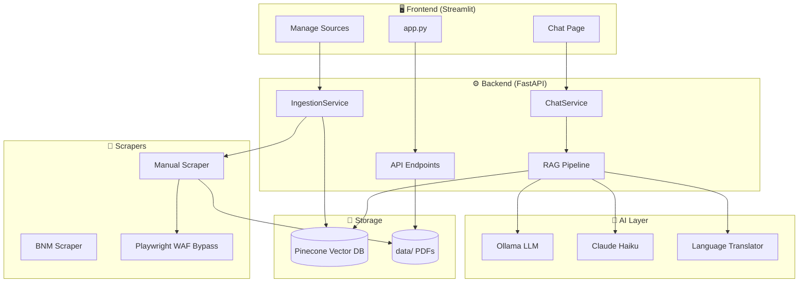
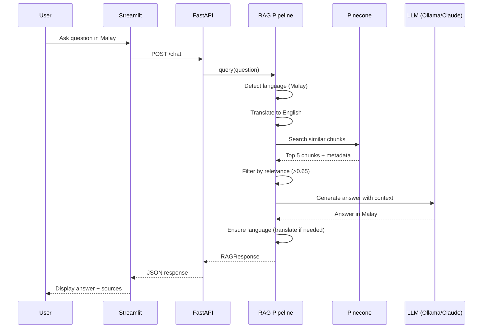
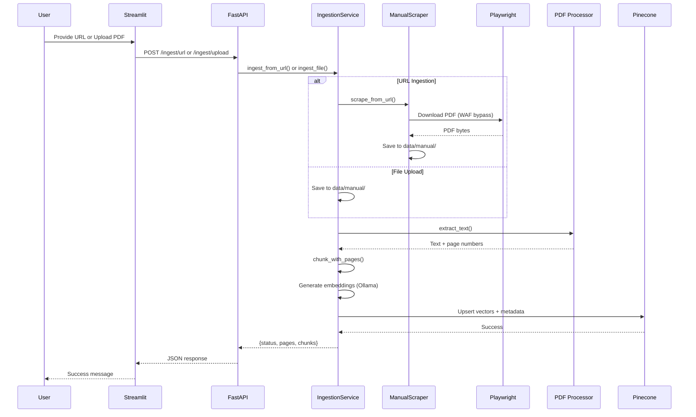

# Agent Deen System Architecture

## High-Level Architecture



## Data Flow: Ask a Question



## Data Flow: Ingest Document



## Storage Structure

```
for-ummah/
├── data/
│   ├── bnm/                    # BNM scraped PDFs
│   │   └── *.pdf
│   ├── manual/                 # User uploads & URL downloads
│   │   └── *.pdf
│   └── processed/
│       └── all_chunks_with_pages.json  # Local backup
│
├── src/
│   ├── api/main.py             # FastAPI endpoints
│   ├── services/
│   │   ├── __init__.py         # ChatService
│   │   └── ingestion.py        # IngestionService
│   ├── ai/
│   │   ├── rag.py              # RAG Pipeline
│   │   ├── ollama_llm.py       # Ollama client
│   │   ├── claude_llm.py       # Claude client
│   │   └── translator.py       # Language enforcement
│   ├── scrapers/
│   │   ├── base.py             # BaseScraper + Playwright
│   │   ├── bnm.py              # BNM website scraper
│   │   └── manual.py           # User upload scraper
│   ├── processors/
│   │   ├── pdf.py              # Text extraction
│   │   └── chunker.py          # Sentence-based chunking
│   └── vector_db/
│       └── pinecone.py         # Pinecone client
│
└── app.py                      # Streamlit frontend
```

## API Endpoints

| Endpoint | Method | Purpose |
|----------|--------|---------|
| `/chat` | POST | Ask a question, get RAG answer |
| `/ingest/url` | POST | Ingest document from URL |
| `/ingest/upload` | POST | Upload and ingest PDF |
| `/pdf/{source}/{filename}` | GET | Serve PDF for viewer |
| `/pdf/list` | GET | List all available PDFs |
| `/health` | GET | Health check |

## Key Components

| Component | File | Purpose |
|-----------|------|---------|
| **RAG Pipeline** | `src/ai/rag.py` | Orchestrates search + LLM |
| **Ingestion** | `src/services/ingestion.py` | PDF processing pipeline |
| **PDF Viewer** | `src/api/main.py` | Serves PDFs with page navigation |
| **Playwright** | `src/scrapers/base.py` | WAF bypass for downloads |
