# Agent Deen System Architecture

## High-Level Architecture

```mermaid
flowchart TB
    subgraph Frontend["🖥️ Frontend (Streamlit)"]
        UI[app.py]
        Chat[Chat Page]
        Sources[Manage Sources]
    end

    subgraph Backend["⚙️ Backend (FastAPI)"]
        API[API Endpoints]
        ChatSvc[ChatService]
        IngestSvc[IngestionService]
        RAG[RAG Pipeline]
    end

    subgraph AI["🤖 AI Layer"]
        Ollama[Ollama LLM]
        Claude[Claude Haiku]
        Translator[Language Translator]
    end

    subgraph Storage["💾 Storage"]
        Pinecone[(Pinecone Vector DB)]
        Supabase[(Supabase PostgreSQL)]
        SupaStorage[(Supabase Storage)]
        PDFs[("data/ local cache")]
    end

    subgraph Scrapers["🔧 Scrapers"]
        BNM[BNM Scraper]
        Manual[Manual Scraper]
        Playwright[Playwright WAF Bypass]
    end

    UI --> API
    Chat --> ChatSvc
    Sources --> IngestSvc
    
    ChatSvc --> RAG
    RAG --> Pinecone
    RAG --> Ollama
    RAG --> Claude
    RAG --> Translator
    
    IngestSvc --> Manual
    Manual --> Playwright
    Manual --> SupaStorage
    IngestSvc --> Pinecone
    IngestSvc --> Supabase

    ChatSvc --> Supabase
    API --> SupaStorage
```



## Data Flow: Ask a Question


## Data Flow: Ingest Document


## Storage Structure

### Supabase Storage (Primary)

```
shariah-documents/ (Storage Bucket)
├── bnm/                        # BNM scraped PDFs
│   └── *.pdf
├── sc_malaysia/                # SC Malaysia PDFs
│   └── *.pdf
└── manual/                     # User uploads & URL downloads
    └── *.pdf
```

### Supabase PostgreSQL

```sql
documents              # Document metadata
chat_sessions          # User conversations
chat_messages          # Message history
ingestion_history      # Ingestion logs
job_status             # Background job state
```

### Local File Structure

```
for-ummah/
├── data/                       # Local cache (optional)
│   ├── bnm/
│   ├── sc_malaysia/
│   └── manual/
│
├── src/
│   ├── api/main.py             # FastAPI endpoints
│   ├── db/                     # Supabase integration
│   │   ├── client.py           # Supabase client
│   │   ├── models.py           # Pydantic models
│   │   ├── storage.py          # Storage service
│   │   └── repositories/       # Database repositories
│   ├── services/
│   │   ├── chat.py             # ChatService
│   │   ├── history.py          # History (Supabase-backed)
│   │   └── ingestion.py        # IngestionService
│   ├── ai/
│   │   ├── rag.py              # RAG Pipeline + Reranking
│   │   ├── ollama_llm.py       # Ollama client
│   │   ├── claude_llm.py       # Claude client
│   │   └── translator.py       # Language enforcement
│   ├── scrapers/
│   │   ├── base.py             # BaseScraper + Playwright
│   │   ├── bnm.py              # BNM website scraper
│   │   ├── sc.py               # SC Malaysia scraper
│   │   └── manual.py           # User upload scraper
│   ├── processors/
│   │   ├── pdf_extractor.py    # Text extraction
│   │   └── chunker.py          # Sentence-based chunking
│   └── vector_db/
│       └── pinecone_store.py   # Pinecone client
│
└── app.py                      # Streamlit frontend
```

## API Endpoints

| Endpoint | Method | Purpose |
|----------|--------|---------|
| `/chat` | POST | Ask a question, get RAG answer |
| `/ingest/url` | POST | Ingest document from URL |
| `/ingest/upload` | POST | Upload and ingest PDF |
| `/pdf/{source}/{filename}` | GET | Serve PDF from Supabase Storage |
| `/pdf/list` | GET | List all available PDFs |
| `/history/chats` | GET | List chat sessions (Supabase) |
| `/history/chat/{id}` | GET/DELETE | Get/delete chat session |
| `/history/sources` | GET | List indexed document sources |
| `/admin/trigger-update` | POST | Trigger background scraper |
| `/admin/job-status` | GET | Get job status |
| `/health` | GET | Health check |

## Key Components

| Component | File | Purpose |
|-----------|------|---------|
| **RAG Pipeline** | `src/ai/rag.py` | Orchestrates search + LLM + Reranking |
| **Ingestion** | `src/services/ingestion.py` | PDF processing pipeline |
| **PDF Viewer** | `src/api/main.py` | Serves PDFs from Supabase Storage |
| **Supabase Client** | `src/db/client.py` | Database + Storage connection |
| **Repositories** | `src/db/repositories/` | Data access layer |
| **Playwright** | `src/scrapers/base.py` | WAF bypass for downloads |
